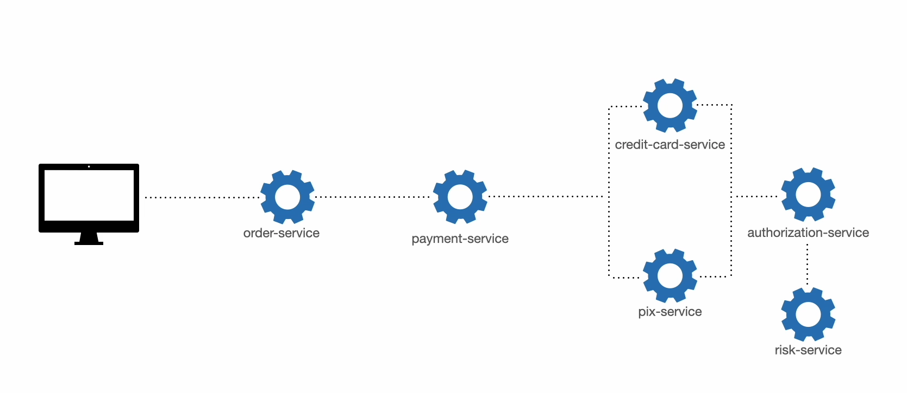
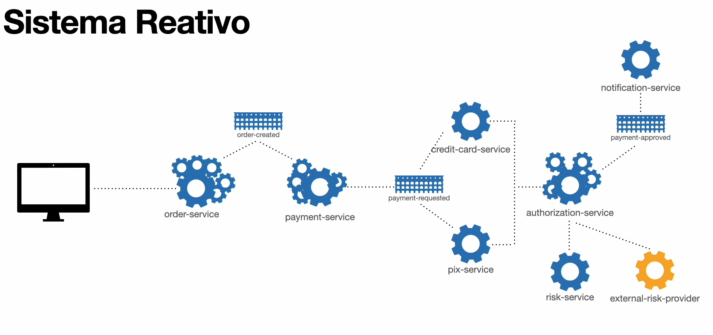
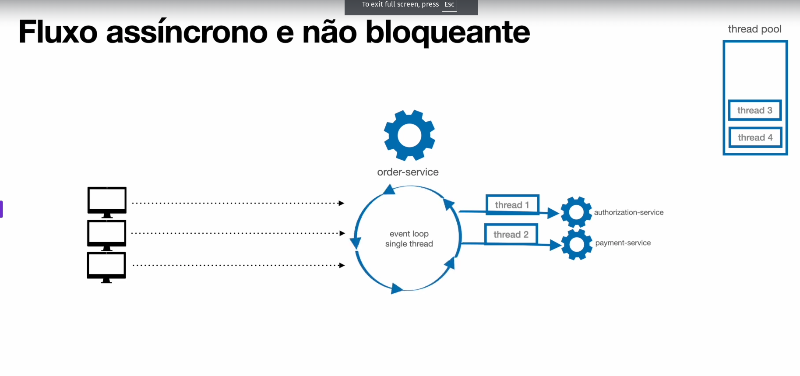
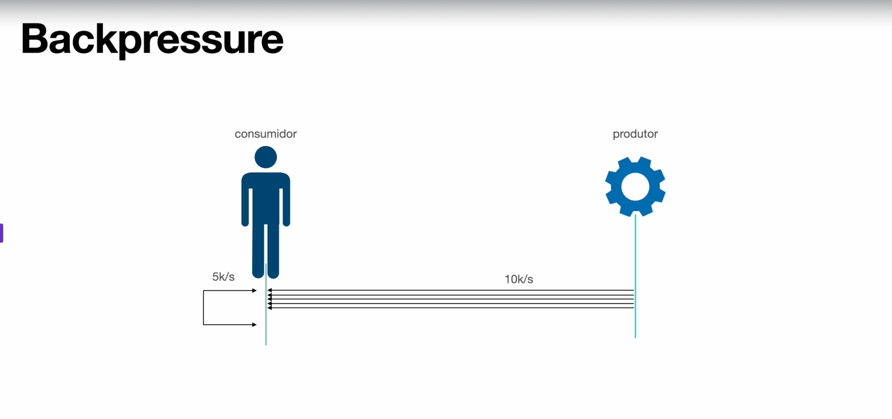

# ⚙️ Sistema Tradicional vs Sistema Reativo

---

## 🏛️ Sistema Tradicional

Sistemas tradicionais seguem uma abordagem **sincrônica e bloqueante**. Cada solicitação ocupa uma thread até que seja totalmente processada. Isso consome recursos de forma linear e apresenta dificuldades para escalar com eficiência sob cargas altas.

---

## ⚡ Sistema Reativo

Sistemas reativos são projetados para lidar de maneira eficiente com **concorrência, falhas e variações de carga**, mantendo alta disponibilidade e desempenho. Eles seguem os princípios do **[Manifesto Reativo](https://www.reactivemanifesto.org/)**, sendo:

- **Responsivos**
- **Resilientes**
- **Elásticos**
- **Orientados a eventos**

Em um sistema reativo, os componentes se comunicam de forma **assíncrona** por meio de **eventos e mensagens**, reduzindo o acoplamento e promovendo escalabilidade. Isso é frequentemente implementado usando **arquiteturas orientadas a eventos** e **streaming de dados**.

---

## 📜 Manifesto Reativo

- **📶 Responsivo**: O sistema responde rapidamente a solicitações, mesmo sob carga.
- **🧬 Elástico**: Adapta-se a variações na carga, escalando horizontal ou verticalmente.
- **🛡️ Resiliente**: Continua funcionando mesmo diante de falhas parciais, mantendo disponibilidade.
- **📡 Orientado a eventos**: Os componentes trocam mensagens assíncronas e são reativos a mudanças.

---

## 💻 Programação Reativa

A **programação reativa** é um paradigma focado no **fluxo de dados assíncrono** e **não bloqueante**, onde mudanças em dados (streams) são **propagadas automaticamente**. Essa abordagem facilita a construção de sistemas com maior desempenho, escalabilidade e resiliência.

---

### 🧠 Modelo Assíncrono e Não Bloqueante

No **Java**, bibliotecas como o **[Project Reactor](https://projectreactor.io/)** implementam o padrão **Reactive Streams**, com os conceitos de `Publisher`, `Subscriber`, `Subscription` e `Processor`.

Nesse modelo:

- O *Event Loop* gerencia tarefas sem bloqueios;
- Tarefas são executadas por **thread pools leves**, permitindo milhares de operações simultâneas com poucas threads;
- O sistema reage a **eventos emitidos dinamicamente**, como cliques, mensagens, ou mudanças em dados.

---

### 🧩 Programação Funcional

A programação reativa combina conceitos da **programação funcional**, como:

- **Imutabilidade**
- **Composição de funções**
- **Streams**
- **Funções puras**

Isso facilita o encadeamento e a manipulação de fluxos de dados complexos de maneira clara e previsível.

---

### 🔁 Fluxos de Dados (Data Streams)

Os dados fluem como **streams de eventos**. Cada transformação gera um novo stream — similar a um `pipeline` — onde cada operador (`map`, `filter`, `flatMap`, etc.) processa os dados de forma assíncrona.

---

### 🧰 Backpressure

O **backpressure** é essencial para evitar sobrecarga. Ele regula o ritmo entre **produtores** e **consumidores** de dados.

> 📌 Se um consumidor não consegue acompanhar o ritmo de produção, o sistema pode pausar, descartar ou armazenar mensagens, evitando perda ou travamentos.

Este conceito está presente em soluções como **Kafka**, onde há balanceamento entre **partições** e **consumidores**, garantindo distribuição eficiente.

---

## 🔍 Definição Prática

> **Programação reativa** é uma forma de construir software que lida com **fluxos de dados dinâmicos**, onde as mudanças são tratadas **de forma assíncrona, não bloqueante** e com **controle de fluxo (backpressure)**.

---

## 📋 Resumo

- **🔁 Sistema Reativo**: Projetado para ser responsivo, resiliente, escalável e orientado a mensagens.
- **🧪 Programação Reativa**: Paradigma que trata eventos e dados de forma assíncrona e não bloqueante.
- **🔗 Fluxo Síncrono**: Tarefas são executadas sequencialmente, bloqueando a thread.
- **⚡ Fluxo Assíncrono**: Tarefas são executadas em paralelo sem bloqueios diretos.
- **🚫 Não Bloqueante**: O código continua executando sem aguardar a finalização de tarefas lentas.
- **📉 Backpressure**: Mecanismo de controle para evitar sobrecarga entre produtores e consumidores.

---

