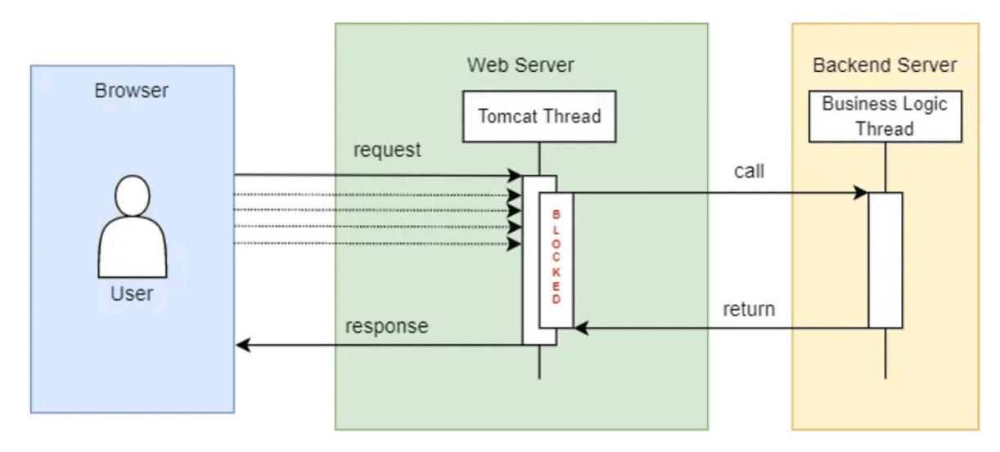

## Post

[Spring WebFlux — Under the hood](https://www.linkedin.com/pulse/spring-webflux-under-hood-diego-lucas-silva/)

Por padrão, o Spring Boot com WebFlux utiliza o servidor Netty, que opera no Modelo de Loop de Eventos , aproveitando o processamento assíncrono e não bloqueante com o padrão reator e múltiplas threads de trabalho.

### Modelo de thread por solicitação

O modelo de thread por solicitação é o modelo tradicional usado em contêineres de servlet como o Tomcat. Nesse modelo, cada solicitação é atendida de forma síncrona por uma thread responsável por processá-la e retornar a resposta. Para processar várias solicitações em paralelo, várias threads são usadas.

Se o aplicativo precisar aguardar uma resposta externa, como uma chamada para outro serviço, a thread entra em estado de espera, aguardando a resposta. Esse cenário pode resultar no bloqueio da solicitação e na inatividade da CPU nesse meio tempo.

Embora o Spring WebFlux também possa ser usado com o Tomcat na implementação do Servlet 3.1+ que permite processamento em segundo plano não bloqueante, isso não é recomendado.

### Modelo de thread de loop de eventos

Este modelo utiliza uma única thread não bloqueante para processar requisições. Para entender melhor, vamos conhecer seus principais componentes:

- **Canal**: Representa uma conexão cliente-servidor. Quando uma solicitação chega, um Canal é criado para tratá-la. Um Canal também pode ser criado para lidar com operações de E/S (por exemplo, escrever em um banco de dados).

- **EventLoop**: É um loop que processa eventos de forma assíncrona. Ele é responsável por gerenciar os canais e as operações de E/S associadas a eles. O EventLoop não bloqueia, permitindo que outras operações sejam processadas enquanto aguarda respostas.

- **Fila de Eventos**:  O Netty utiliza uma fila de eventos, conhecida como Fila de Eventos. Nessa fila, as tarefas aguardam em ordem de chegada ( primeiro a entrar, primeiro a sair ) para serem processadas de forma assíncrona pelo EventLoop. Isso permite que o Netty processe tarefas de forma eficiente e sem bloquear a execução de outras tarefas na aplicação.

1. Uma requisição é enviada a uma aplicação Spring WebFlux com Netty, gerando a tarefa 3 (em laranja na imagem). Um canal é criado para processar a requisição. Observe que já existem duas tarefas ( tarefa 1 e tarefa 2 ) para serem executadas na fila de execução do Netty ( Fila de Eventos ).
2. A tarefa 3 vai para a Fila de Eventos para aguardar sua vez no processamento do EventLoop. Nesse ponto, a tarefa 1 está sendo processada e a tarefa 2 é a próxima na fila.
3. Enquanto isso, outra solicitação é enviada ao aplicativo ( tarefa 4 em vermelho ) e um novo Canal é criado para lidar com ela.
4. A tarefa 4 também é adicionada à Fila de Eventos e aguarda sua vez de ser processada pelo EventLoop. Observe que, neste ponto, a tarefa 2 já foi processada pelo EventLoop.
5. O EventLoop seleciona a tarefa 3 para processamento. Esta tarefa requer uma operação de E/S mais demorada. Para que o EventLoop não seja bloqueado, esta tarefa é enviada para outra thread para processá-la. Dessa forma, o EventLoop fica disponível para executar as próximas tarefas da Fila de Eventos.
6. A tarefa 4 é selecionada para processamento. Esta tarefa não requer nenhum processamento de E/S, portanto, é encerrada pelo EventLoop e a resposta é enviada de volta ao cliente.
7. A tarefa 3 é finalizada por um thread paralelo e retorna para a Fila de Eventos.
8. O EventLoop agora executa a próxima tarefa que estava na Fila de Eventos, que é a tarefa 3. O processamento é concluído e a resposta é retornada ao cliente.

