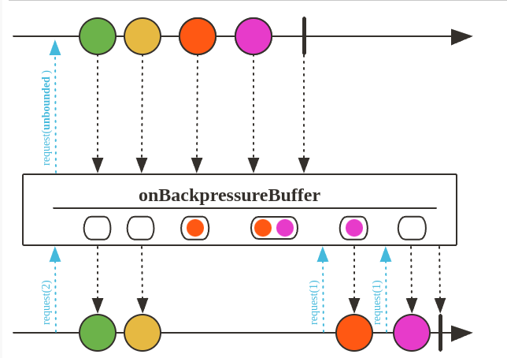
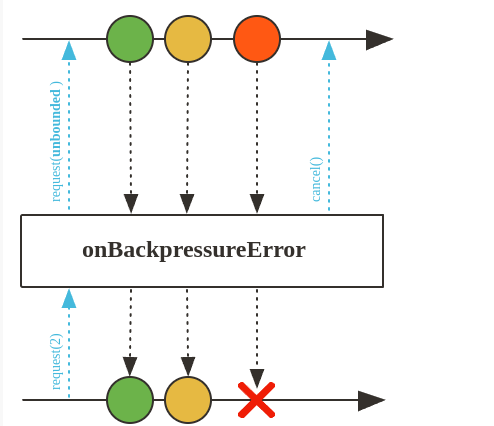
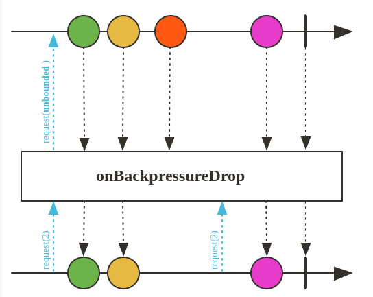
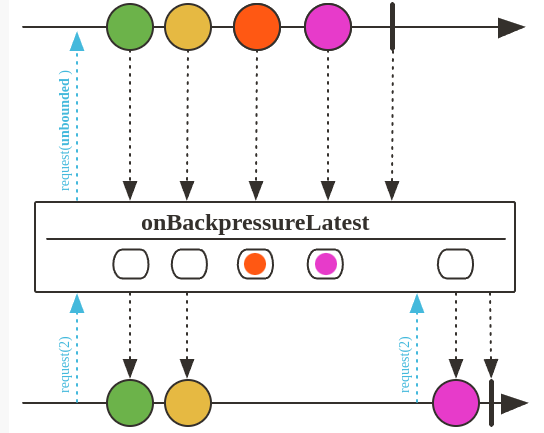

# Backpressure

Backpressure é um mecanismo de controle para lidar com discrepância de velocidade entre a produção e o consumo de dados em fluxos reativos.

## Backpressure strategy - buffer onBackpressureBuffer

Solicite uma demanda ilimitada e envie para o elemento retornado Flux, ou estacione os elementos observados se não houver demanda suficiente solicitada posteriormente. Os erros serão adiados até que o buffer seja consumido.



```java
    @Test
    public void backPressureBuffer() throws InterruptedException {

        System.setProperty("reactor.bufferSize.small", "16");

        Flux.interval(Duration.ofMillis(1))
                .onBackpressureBuffer(20)
                .log("filter")
                .publishOn(Schedulers.single())
                .map(number -> {
                    try {
                        Thread.sleep(500);
                    } catch (InterruptedException e) {
                        throw new RuntimeException(e);
                    }
                    System.out.println(Thread.currentThread().getName()+ " Consuming number "+number);
                    return number;
                })
                .subscribe();

        Thread.sleep(50_0000);
    }
```

## Backpressure strategy - drop onBackpressureError

Solicite uma demanda ilimitada e envie para o retornado Flux, ou emita onError Exceptions.failWithOverflow()se não for solicitada demanda suficiente a downstream.

Não altera o comportamento que ja existe no caso do teste abaixo. È lançada uma exceção quando o buffer é excedido. Quando ha mais item do que o suportado o buffer é descartado e o erro é lançado.



``` java
    @Test
    public void backPressureError() throws InterruptedException {

        System.setProperty("reactor.bufferSize.small", "16");

        Flux.interval(Duration.ofMillis(1))
                .onBackpressureError()
                .publishOn(Schedulers.single())
                .map(number -> {
                    try {
                        Thread.sleep(500);
                    } catch (InterruptedException e) {
                        throw new RuntimeException(e);
                    }
                    System.out.println(Thread.currentThread().getName()+ " Consuming number "+number);
                    return number;
                })
                .subscribe();

        Thread.sleep(50_0000);
    }
```

## Backpressure strategy - latest onBackpressureDrop

Descar os itens extras quando o subscriber não consegue acompanha o fluxo

Solicite uma demanda ilimitada e envie para o retornado Flux, ou descarte os elementos observados se não for solicitada demanda suficiente a downstream.

O coportamento no teste é que não é gerado o exception, depois que o buffer é excedido, os elementos são descartados é são consumidos novamento quando os elementos do buffer são consumidos.



``` java
    @Test
    public void backPressureDrop() throws InterruptedException {

        System.setProperty("reactor.bufferSize.small", "16");

        Flux.interval(Duration.ofMillis(1))
                .onBackpressureDrop()
                .publishOn(Schedulers.single())
                .map(number -> {
                    try {
                        Thread.sleep(500);
                    } catch (InterruptedException e) {
                        throw new RuntimeException(e);
                    }
                    System.out.println(Thread.currentThread().getName()+ " Consuming number "+number);
                    return number;
                })
                .subscribe();

        Thread.sleep(50_0000);
    }
```

## Backpressure strategy - ignore onBackpressureLatest

Mantém apenas o elemento mais recente no buffer quando cheio, descartando os eleemntos mais antigos.

Solicite uma demanda ilimitada e envie para o item retornado Flux, ou mantenha apenas o item observado mais recentemente se não for solicitada demanda suficiente a downstrem.



``` java
@Test
    public void backPressureLatest() throws InterruptedException {

        System.setProperty("reactor.bufferSize.small", "16");

        Flux.interval(Duration.ofMillis(1))
                .onBackpressureLatest()
                .publishOn(Schedulers.single())
                .map(number -> {
                    try {
                        Thread.sleep(500);
                    } catch (InterruptedException e) {
                        throw new RuntimeException(e);
                    }
                    System.out.println(Thread.currentThread().getName()+ " Consuming number "+number);
                    return number;
                })
                .subscribe();

        Thread.sleep(50_0000);
    }
```

## Fluz.create() with Backpressure

``` java
@Test
    public void createOperatorBackPressureStrategies() throws InterruptedException {
        System.setProperty("reactor.bufferSize.small", "16");

        Flux<Object> fluxTest = Flux.create(emitter -> {
            for(int i = 0; i < 10_00000; i++){
                emitter.next(i);
            }
            emitter.complete();
        },
  //Overflow strategy
  // FluxSink.OverflowStrategy.BUFFER(padrão)
  // FluxSink.OverflowStrategy.DROP
  // FluxSink.OverflowStrategy.ERROR
  // FluxSink.OverflowStrategy.LATEST
  FluxSink.OverflowStrategy.LATEST
  );


        fluxTest
                .publishOn(Schedulers.boundedElastic())
                .map(number -> {
                    try {
                        Thread.sleep(1);
                    } catch (InterruptedException e) {
                        throw new RuntimeException(e);
                    }
                    System.out.println(Thread.currentThread().getName()+ " Consuming number "+number);
                    return number;
                })
                .subscribe();

        Thread.sleep(10_00000);
    }
```

## Resumo

Backpressure é um mecanismo de controle para lidar com a discrepância de velocidade entre a produção e o consumo de dados em fluxos reativos.

- **onBackpressureBuffer():** Armazena os elementos em um buffer temporariamente quando não é solicitado demanda suficiente no downstream.

- **onBackpressureError():** Gera um erro de backpressure imediatamente quando não é solicitado demanda suficiente no downstream.

- **onBackpressureDrop():** Descarta elementos quando não é solicitado demanda suficiente no downstream.

- **onBackpressureLatest():** Mantém apenas o último elemento emitido no buffer quando não é solicitado demanda suficiente no downstream, permitindo que o mais recente substitua os anteriores.
