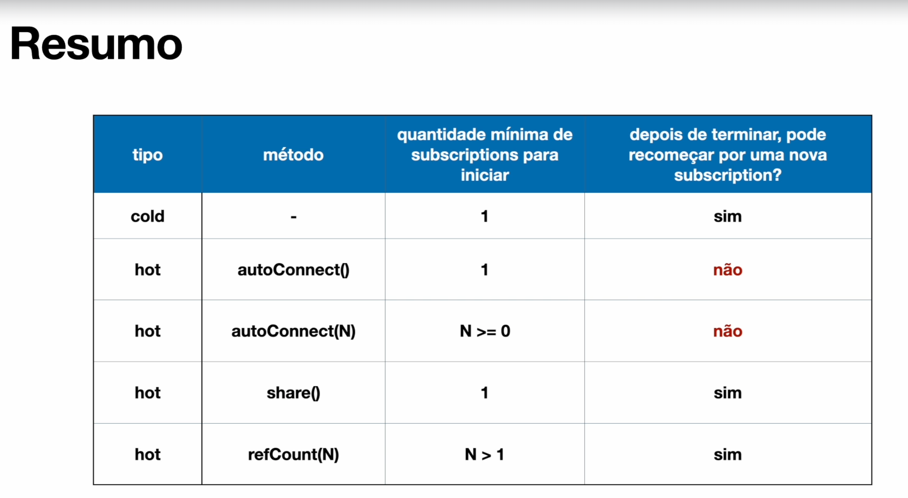

# Hot e Cold Publisher

## Cold Publisher

Cold publishers geram dados novamente para cada inscrição. Se nenhuma inscrição é criada, os dados nunca são gerados. É o tipo de publisher padrão que já utilizamos. Quando um valor é solicitado, o publisher executa todo o processo definido pelos operadores para cada consumidor que se inscreve.

Cada consumidor recebe a sequência completa de valores desde o início, pois cada novo subscriber faz com que o processo definido pelos operadores no Flux seja executado.

```java
// Cold Publisher
@Test
public void testColdPublisher(){
    YoutubeChannel youtubeChannel = new YoutubeChannel(MockVideo.generateVideos());

    youtubeChannel.getAllVideosName()
            .subscribe(value -> System.out.println("Subscribe 1 " + value));
    System.out.println("----------");
    youtubeChannel.getAllVideosName()
            .subscribe(value -> System.out.println("Subscribe 2 " + value));
}
```

## Hot Publisher

Hot publishers não dependem de qualquer número de subscribers. Eles podem começar a publicar dados imediatamente e continuarão fazendo isso sempre que um novo Subscriber chegar (neste caso, o subscriber verá apenas novos elementos emitidos após sua inscrição).

Para hot publishers, algo realmente acontece antes de você se inscrever. Funciona como um evento ao vivo (live stream) - o processo descrito pelos operadores no Flux é executado independentemente de quando as inscrições foram anexadas.

```java
package com.dls.projectreactorexamples;

import reactor.core.publisher.Flux;
import java.time.Duration;

public class VideoLive {
    private String title;

    public VideoLive(String title){
        this.title = title;
    }

    public Flux<String> play(){
        return Flux.interval(Duration.ofMillis(500))
                .map(value -> getLiveEvent(value))
                .takeWhile(event -> !event.equals("End"))
                .publish().autoConnect();
    }

    public Flux<String> playN() {
        return Flux.interval(Duration.ofMillis(500))
                .map(value -> getLiveEvent(value))
                .takeWhile(event -> !event.equals("End"))
                .publish().autoConnect(2);
    }

    public Flux<String> playResubscription() {
        return Flux.interval(Duration.ofMillis(500))
                .map(value -> getLiveEvent(value))
                .takeWhile(event -> !event.equals("End"))
                .share();
    }

    private String getLiveEvent(Long sequence){
        switch (sequence.intValue()) {
            case 0:
                return "🟢 Live stream starts";
            case 1:
                return "⚡️ New feature announced!...";
            case 2:
                return "💬 Live chat...";
            case 3:
                return "🎉 Giveaways...";
            case 4:
                return "⏰ Next event announced!...";
            case 7:
                return "⏰ Our Live stream has come to an end!";
            case 8:
                return "End";
            default:
                return "⌛️ In progress...";
        }
    }
}
```

## AutoConnect

O `autoConnect()` transforma um `ConnectableFlux` em um **Hot Publisher**. O autoConnect aguarda pela quantidade especificada de subscribers, conecta uma vez e nunca se desconecta quando todos os subscribers cancelam a inscrição.

Quando um segundo consumidor se inscreve, o publisher já está emitindo valores, e este segundo consumidor recebe apenas os valores a partir do momento de sua inscrição. Um terceiro consumidor também não recebe os valores emitidos antes de sua inscrição.

```java
@Test
public void testHotPublishAutoConnect() throws InterruptedException {
    VideoLive videoLive = new VideoLive("Meetup about java 21");

    Flux<String> java21Live = videoLive.play();

    java21Live.subscribe(value -> System.out.println("User 1 " + value));

    Thread.sleep(2000);

    java21Live.subscribe(value -> System.out.println("User 2 " + value));

    Thread.sleep(4000);

    java21Live.subscribe(value -> System.out.println("User 3 " + value));

    Thread.sleep(20_000);
}
```

## AutoConnect com N

É possível definir o número mínimo de consumidores que precisam se inscrever para que o publisher comece a emitir valores. No exemplo abaixo, o publisher só começa a emitir valores quando **dois** consumidores se inscrevem.

```java
@Test
public void testHotPublishAutoConnectN() throws InterruptedException {
    VideoLive videoLive = new VideoLive("Meetup about java 21");

    Flux<String> java21Live = videoLive.playN();

    Thread.sleep(2000);

    java21Live.subscribe(value -> System.out.println("User 1 " + value));

    Thread.sleep(2000);

    java21Live.subscribe(value -> System.out.println("User 2 " + value));

    Thread.sleep(4000);

    java21Live.subscribe(value -> System.out.println("User 3 " + value));

    Thread.sleep(20_000);
}
```

## Resubscription

Similar ao `autoConnect()`, mas quando o publisher é finalizado e recebe uma nova inscrição, ele reinicia o publisher. Os consumidores recebem os valores a partir do momento em que se inscrevem.

O share() é um atalho para publish().refCount(). O refCount() é como autoConnect() exceto por uma funcionalidade adicional: ele se desconecta quando todos os subscribers cancelaram ou - e essa é a situação aqui - o stream foi completado.

Com o método refCount(), podemos definir quantos Subscribers precisam estar inscritos para que o Hot Publisher comece a emitir dados. Sem este método, o share() se comportará como refCount(1), exigindo pelo menos um Subscriber. Enquanto houver inscrições com o número mínimo de consumidores, o publisher continua emitindo valores. Quando não houver inscrições com o número mínimo de consumidores, o publisher é finalizado, mas como share(), o stream de dados é reiniciado quando a contagem de subscribers cai para zero.

```java
@Test
public void testHotPublishReSubscription() throws InterruptedException {
    VideoLive videoLive = new VideoLive("Meetup about java 21");

    Flux<String> java21Live = videoLive.playResubscription();

    Thread.sleep(2000);

    java21Live.subscribe(value -> System.out.println("User 1 " + value));

    Thread.sleep(2000);

    java21Live.subscribe(value -> System.out.println("User 2 " + value));

    Thread.sleep(4000);

    java21Live.subscribe(value -> System.out.println("User 3 " + value));

    Thread.sleep(20_000);
}
```

## Resumo

### Cold Publisher
- Geram dados novamente para cada inscrição
- Cada consumidor recebe a sequência completa desde o início
- Cada subscriber faz com que o processo definido pelos operadores seja executado
- Comportamento padrão dos publishers no Project Reactor

### Hot Publisher
- Não dependem de qualquer número de subscribers
- Consumidores recebem apenas valores emitidos após sua inscrição
- O processo é executado independentemente de quando as inscrições foram anexadas
- Criado usando `publish().autoConnect()` ou `share()` pode ser usado para transformar um cold publisher em hot

### Operadores Principais
- **`autoConnect()`**: Conecta uma vez e nunca se desconecta quando todos os subscribers cancelam
- **`autoConnect(n)`**: Aguarda 'n' consumidores antes de iniciar
- **`share()`**: Atalho para publish().refCount() - permite resubscrição e reinicialização quando a contagem de subscribers cai para zero


