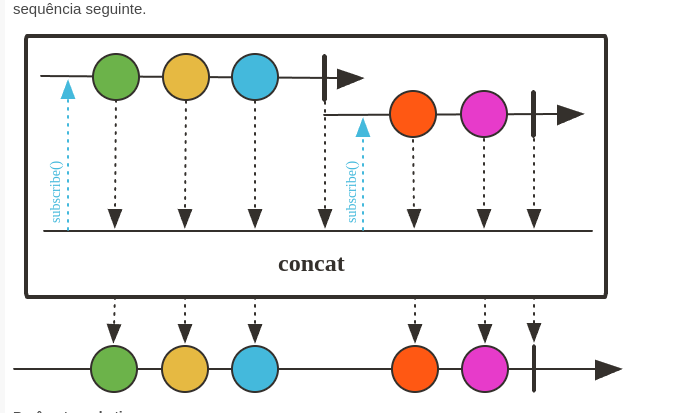
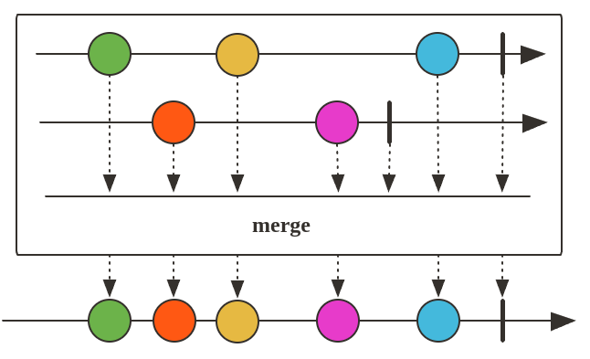
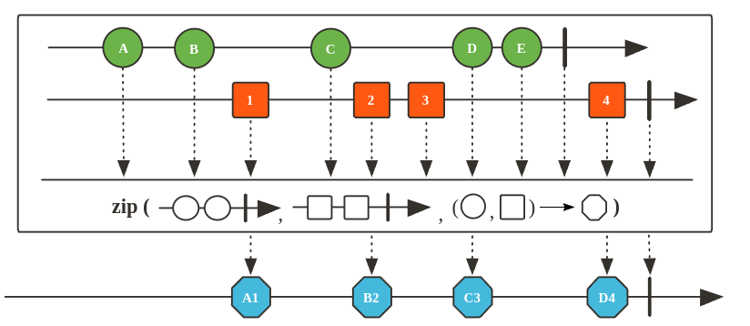

# Operadores combinação

## Concat

Concatene todas as fontes fornecidas em um Iterable, encaminhando elementos emitidos pelas fontes a jusante.
A concatenação é alcançada **assinando sequencialmente a primeira fonte e aguardando sua conclusão antes de assinar a próxima**, e assim por diante até a conclusão da última fonte. Qualquer erro interrompe a sequência imediatamente e é encaminhado para a sequência seguinte.



``` java
    @Test
    public void concatVideoNames() throws InterruptedException {
        Flux<String> videoNames = new YoutubeChannel(MockVideo.generateVideos())
                .getAllVideosName().delayElements(Duration.ofSeconds(1));
        Flux<String> videoNames2 = new YoutubeChannel(MockVideo.generateVideos2()).getAllVideosName();

        //videoNames.concatWith(videoNames2).log().subscribe();
        Flux.concat(videoNames, videoNames2).log().subscribe();

        Thread.sleep(10000); // Espera o tempo necessário para que todos os elementos sejam emitidos
    }
```

## Merge

Mescle dados de Publisher sequências contidas em um array/vararg em uma sequência mesclada intercalada. Ao contrário de concat, as fontes são assinadas com eagerly.



## Zip

criação de pares de elementos de publishers diferentes.

Compacte duas fontes, ou seja, espere que todas as fontes emitam um elemento e combine esses elementos uma vez em um valor de saída (construído pelo combinador fornecido). O operador continuará fazendo isso até que qualquer uma das fontes seja concluída. Os erros serão encaminhados imediatamente. Este processamento de "Mesclagem por Etapas" é especialmente útil em cenários de Dispersão e Reunião.


