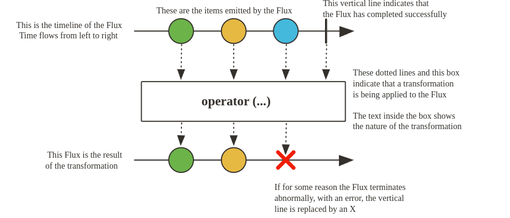
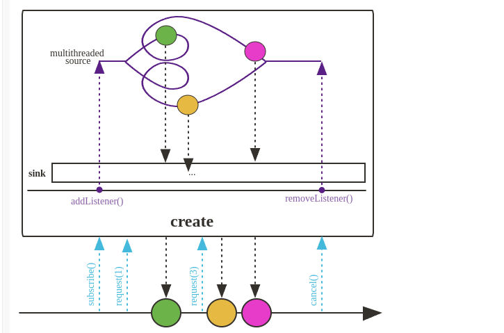

# Operadores

## Leitura basica dos graficos



## Flux create

Crie programaticamente um aplicativo Flux com a capacidade de emitir múltiplos elementos de forma síncrona ou assíncrona por meio da FluxSink API. Isso inclui a emissão de elementos de múltiplas threads.

A emissão de multiplos elementos pode ser feita pelo **CompletableFuture**



``` java

Flux.create(emitter ->
{
 BufferedReader reader = new BufferedReadeer (new FileReader("file.txt"));

 String line;

 while ((line = reader.readLine()) != null)
 {
  emitter.next(line);
 }
 reader.close();
 emitter.complete();
})

```

## Flux generate


Cria o fluxo com capacidade de emitir elementos um por um de maneira síncrona utilizando SyncrhonousSink.

``` java
package com.dls.projectreactorexamples;

import org.junit.jupiter.api.Test;
import reactor.core.publisher.Flux;
import reactor.test.StepVerifier;

import java.io.*;

public class GenerateOperatorTest {

    @Test
    public void testFileReadingGenerate(){
        String filePath = "/Users/diegolucas/Downloads/project-reactor-examples/src/test/resources/example.txt";

        Flux fileFlux = Flux.generate(
                () -> { //Estado inicial
                    try {
                        System.out.println("creating bufferedReader");
                        return new BufferedReader(new FileReader(filePath));
                    } catch (FileNotFoundException e) {
                        throw new RuntimeException(e);
                    }
                },
                ((bufferedReader, synchronousSink) -> { //estado inical e o sink
                    try {
                        String line = bufferedReader.readLine();
                        if(line !=null){
                            synchronousSink.next(line);
                        }else
                            synchronousSink.complete();
                    } catch (IOException exception) {
                        synchronousSink.error(exception);
                    }
                    return bufferedReader; //retorna o estado atualizado
                }),
                bufferedReader -> { //finalizador
                    try {
                        System.out.println("End - closing file");
                        bufferedReader.close();
                    } catch (IOException e) {
                        throw new RuntimeException(e);
                    }
                }
        ).log();

        StepVerifier.create(fileFlux)
                .expectNext("Line 1")
                .expectNext("Line 2")
                .expectNext("Line 3")
                .expectComplete()
                .verify();

    }
}
```


## Resumo

- **Just** - Cria um flux ou Mono de maneira simples.
- **fromIterable** - Cria um flux ou Mono a partir de uma coleção.
- **fromArray** - Cria um flux ou Mono a partir de um array.
- **fromStream** - Cria um flux ou Mono a partir de um stream.
- **range** - Cria um flux ou Mono a partir de um intervalo de números.

- **Flux.create** - cria um Flux com a capaciade de emitir múltiplos elementos de maneira sícrona ou assíncrona. Permite a emissão de elementos a partir de muĺtiplas threads.

- **Flux.generate** - Cria um flux com a capacidade de emitir elementos um por um de maneira síncrona utilizando SyncrhonousSink.


