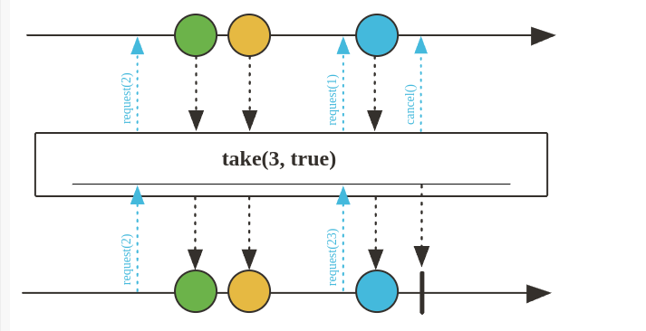
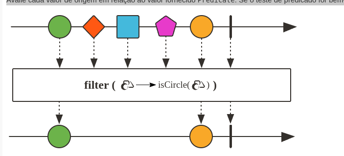

# Operadores

## Take

Unbounded - chamar todos elementos

Pegue apenas os primeiros N valores deste Flux, se disponíveis. Se n for zero, a fonte nem sequer está inscrita e o operador é concluído imediatamente após a inscrição.

Isso garante que a quantidade total solicitada a montante seja limitada a n, embora solicitações menores possam ser feitas se a jusante fizer solicitações < n. Em qualquer caso, esse operador nunca permite que a montante produza mais elementos do que o limite e pode ser usado para aderir mais estritamente à contrapressão.

Este modo é normalmente útil para casos em que uma corrida entre solicitação e cancelamento pode levar o upstream a produzir muitos dados estranhos, e tal produção é indesejável (por exemplo, uma fonte que enviaria os dados estranhos pela rede). É equivalente a take(long, boolean)with limitRequest == true. Se houver um requisito para solicitação upstream ilimitada (por exemplo, por questões de desempenho), use take(long, boolean)with limitRequest=false.



## Map

Transforme os itens emitidos por isso Flux aplicando uma função síncrona a cada item.


## FlatMap

util quando temos um flux e queremos usar seus elementos para criar outro flux.

Transforme os elementos emitidos de Flux forma assíncrona em Publicadores e, em seguida, nivele esses publicadores internos em um único Fluxpor meio de mesclagem, o que permite que eles se intercalem.

- **Geração de inners e assinaturas** : esta operadora está assinando ansiosamente seus inners.
- **Ordenação dos valores achatados** : este operador não preserva necessariamente a ordenação original, pois os elementos internos são achatados à medida que chegam.
**Intercalação**: este operador permite que valores de diferentes sequências internas se intercalem (semelhante à mesclagem de sequências internas).

Nas minhas palavras, Na imagem a baixo primeiro temos dois fluxos, o primeiro passo é subscrever um dos fluxos, depois subscrever o segundo fluxo, como pode ser visto na imagem, não é possível manter a ordem dos fluxos, pois os fluxos são processados de modo assíncrono.


``` java
    @Test
    public void flatMapVideosName() {
        List<YoutubeChannel> channelList = Arrays.asList(
                new YoutubeChannel(MockVideo.generateVideos()),
                new YoutubeChannel(MockVideo.generateVideos2())
        );

        Flux<YoutubeChannel> channelFlux = Flux.fromIterable(channelList);

        channelFlux.flatMap(channel -> channel.getAllVideosName()).log()
                .subscribe();
    }
```

## Filter

Avalie cada valor de origem em relação ao valor fornecido Predicate. Se o teste de predicado for bem-sucedido, o valor será emitido. Se o teste de predicado falhar, o valor será ignorado e uma solicitação de 1 será feita ao upstream.




## Delay

Atrase cada um desses Fluxelementos ( Subscriber.onNext(T) sinais) por um determinado período Duration. Os sinais são atrasados ​​e continuam no parallelAgendador padrão, mas sequências vazias ou sinais de erro imediatos não são atrasados.


> Fluxo assíncrono e não bloqueante, Quando a thread principal é liberado no contexto dos teste o fluxo é finalizado, por esse motivo utilizando o stepVerifier é necessário utilizar o método expectComplete(). é Algo similar que temos em go quando utilizamos o go routine.


## Transform

A transformação é um agregador de operadores que permite que você aplique uma função a cada elemento emitido por um Flux ou Mono, transformando-o em outro tipo de elemento.


``` java
    @Test
    public void transformExample() {
        YoutubeChannel youtubeChannel = new YoutubeChannel(MockVideo.generateVideos());

        youtubeChannel
                .getAllVideos()
                .transform(transformMethod())
                .subscribe(videoName -> System.out.println(videoName));
    }

    Function<Flux<Video>, Flux<String>> transformMethod() {
        return flux -> flux.filter(video -> video.getLikes() > 100)
                .map(video -> video.getName())
                .map(videoName -> videoName.toUpperCase());

    }
```

## Side effects

Se parece muito com os ciclos de vida de um framework como vue e angular

- doOnFirst
- doOnSubscribe
- doOnNext
- doOnRequest
- doOnComplete
- doOnError
- doOnCancel
- doFinally


## Resumo

- **just(), fromIterable(), fromArray(), fromStream(), range(), Mono.just()**:Creation methods.

- **take()**: Limits the number of elements emitted by a Flux or Mono.

- **filter()**: Used to filter values.

- **map()**:Transforms the emitted items.

- **flatMap()**: Transforms the elements emitted by a Flux into inner Publishers and then merges them into a single Flux.

- **delayElements()**: Delays the emission of each element in a Flux or Mono by a specified duration.

- **transform()**: Used to apply a custom transformation to a Flux or Mono

- **sideEffects**: Allow the addition of side effects without modifying the data stream.
