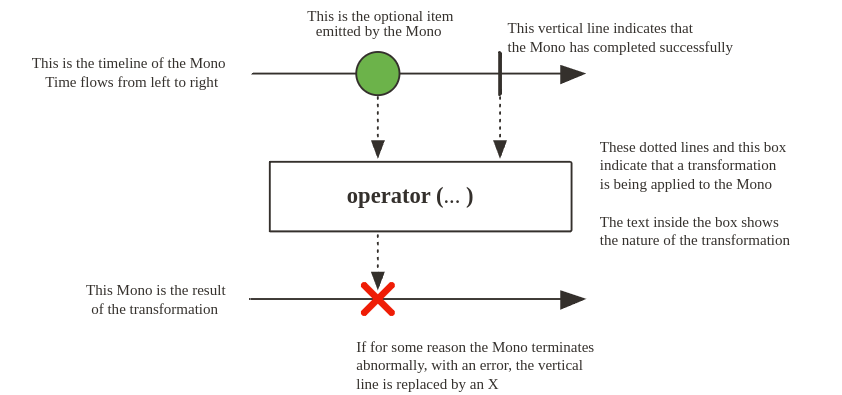
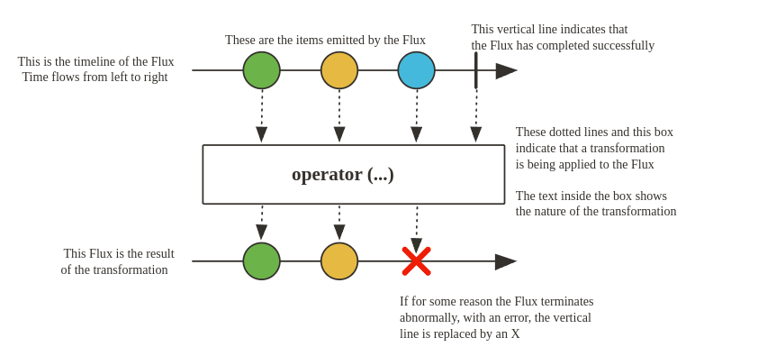

# Projecto Reacto

- **Mono** Um unico elemento
- **Flux** Uma sequencia de elementos

## Mono

0 ou 1 elemento.

Um Streams Reativo Publisher com operadores rx básicos que emite no máximo um item por meio do onNext sinal e então termina com um onComplete sinal (Mono bem-sucedido, com ou sem valor) ou emite apenas um único onError sinal (Mono com falha).

## Flux

2 ou mais elementos. Se você quiser emitir 0 ou 1 elemento, use Mono.

Um Reactive Streams Publisher com operadores rx que emite de 0 a N elementos e depois conclui (com sucesso ou com erro).

## Resumo

### Sobre o Project Reactor

- Biblioteca reativa baseada no especificação do Reactive Streams;

- Base para a stack reativa do Spring;

- Flux: Representa um fluxo de dados de 0 ou mais elementos;

- Mono: Representa um 0 ou 1 elemento;

- O consumo só inicia com o subscribe().

Nesse módulo também, usamos o operador log() para conseguirmos ver mais detalhes no console. Seu objetivo é apenas dar visibilidade dos sinais emitidos a caráter de teste.
