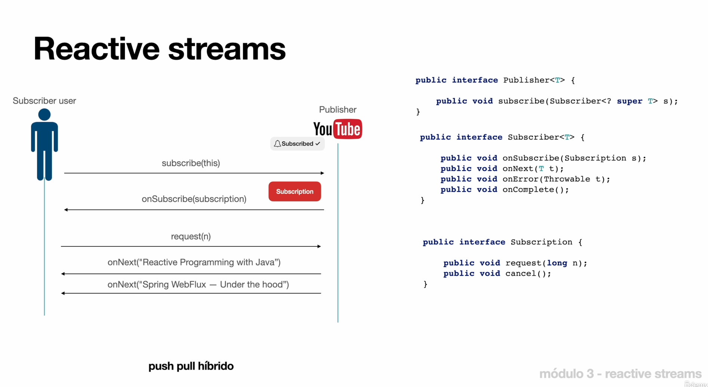

**02-06-25**

# Introdução ao Reactive Streams

## Reactive Streams

O reactive Streams é um padrão é especificação pra biblioteca reativas orientas a stream para jvm.

- Processam um número potencialmente ilimitado de elementos em sequência
- Passm elementos de forma assíncorna entre os componentes.
- Executa de forma não bloqueante com backpressure.

A biblioteca project reacto segue as especificações.

## Ractive Componentes

**Publisher**: Representa a fonte de dados que fornece informações a serm consumidas

**Subscriber**: representa o consumidor de dados que receber e reage ás informações fornecidas pelo Publisher.

**Subscription**: Age como intermediário, permitindo que os Subscribers controlem o fluxo de dados recebidos dos Publishers.

**Processor**: Atua como um componente flexível que pode funiconar como um Subscriber ou PUblisher.

## Exemplo

push pull híbrido

1. O Subscriber se inscreve no Publisher, solicitando dados.
2. O publisheer cria uma Subscription com o Subscriber.
3. O Subscription realizar as chamadas para os metodos do Subscriber.

## Resumo

- Reactive Streams é um padrão e especificação para bibliotecas reativas;

- Composta por 4 componentes: Publisher, Subscriber, Subscription e Processor;

- A biblioteca Project Reactor implementa o Reactive Streams;

- O Project Reactor é a base para stack reativa do Spring.
