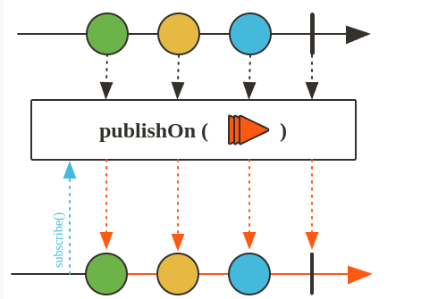
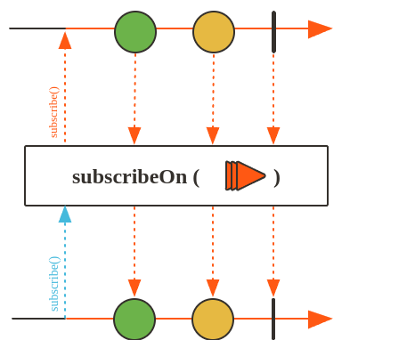

# Schedulers

## Exemplo block

```java
    @Test
    public void blockingOperation() throws InterruptedException {
        YoutubeChannel youtubeChannel = new YoutubeChannel(MockVideo.generateVideos());

        Flux<String> videos = youtubeChannel.getAllVideos()
                .filter(video -> {
                    System.out.println("Filter1 - Thread: " + Thread.currentThread().getName());
                    return video.getDescription().length() > 10;
                })
                .map(video -> {
                    System.out.println("Map1 - Thread" + Thread.currentThread().getName());
                    return video.getDescription();
                })
                .map(description -> {
                    try {
                        Thread.sleep(1000);
                        System.out.println("Map2 - Thread " + Thread.currentThread().getName());
                    } catch (InterruptedException e) {
                        throw new RuntimeException(e);
                    }
                    return description.toUpperCase();
                });

        for (int i = 0; i < 2; i++) {
            System.out.println("Execution " + i);
            videos.subscribe(description -> System.out.println(description));
        }
        Thread.sleep(20_000);
    }
 ```

## publishOn(Scheduler.boundedElastic())

Este operador influencia o contexto de threading onde o restante dos operadores na cadeia abaixo dele serão executados, até uma nova ocorrência de publishOn.

O publishOn torna a operação seguinte em uma nova thread, permitindo que a operação seja executada de forma assíncrona e não bloqueante.

Existem tres tipos de Schedulers:
- boundedElastic
- parallel
- single



``` java
@Test
    public void publishOnBlockingOperation() throws InterruptedException {
        YoutubeChannel youtubeChannel = new YoutubeChannel(MockVideo.generateVideos3());

        Flux<String> videos = youtubeChannel.getAllVideos()
                .filter(video -> {
                    System.out.println("Filter1 - Thread: " + Thread.currentThread().getName());
                    return video.getDescription().length() > 10;
                })
                .map(video -> {
                    System.out.println("Map1 - Thread" + Thread.currentThread().getName());
                    return video.getDescription();
                })
                .publishOn(Schedulers.boundedElastic())
                .map(description -> { // Executará em uma nova thread
                    try {
                        Thread.sleep(1000);
                        System.out.println("Map2 - Thread " + Thread.currentThread().getName());
                    } catch (InterruptedException e) {
                        throw new RuntimeException(e);
                    }
                    return description.toUpperCase();
                });
    //    videos.subscribe(description -> System.out.println(description));
        for (int i = 0; i < 20; i++) {
            System.out.println("Execution " + i);
            videos.subscribe(description -> System.out.println(description));
        }
        Thread.sleep(20_000);
    }

```

## subscribeOn()

Execute subscribe, onSubscribe e request em um Scheduler's especificado Scheduler.Worker. Portanto, colocar este operador em qualquer lugar da cadeia também impactará o contexto de execução dos sinais onNext/onError/onComplete desde o início da cadeia até a próxima ocorrência de um ' publishOn.


```java
@Test
    public void subscribeOnBlockingOperation() throws InterruptedException {
        YoutubeChannel youtubeChannel = new YoutubeChannel(MockVideo.generateVideos3());

        Flux<String> videos = youtubeChannel.getAllVideos()
                .filter(video -> {
                    System.out.println("Filter1 - Thread: " + Thread.currentThread().getName());
                    return video.getDescription().length() > 10;
                })
                .map(video -> {
                    System.out.println("Map1 - Thread" + Thread.currentThread().getName());
                    return video.getDescription();
                })
                .subscribeOn(Schedulers.boundedElastic())
                .map(description -> { // Executará em uma nova thread
                    try {
                        Thread.sleep(1000);
                        System.out.println("Map2 - Thread " + Thread.currentThread().getName());
                    } catch (InterruptedException e) {
                        throw new RuntimeException(e);
                    }
                    return description.toUpperCase();
                });


        for (int i = 0; i < 20; i++) {
            System.out.println("Execution " + i);
            //para esse caso cada execução do subscribe, o onSubscribe e request serão executados na thread separada.
            videos.subscribe(description -> System.out.println(description));
        }
        Thread.sleep(20_000);
    }
```

## Parallel

Mesmo no exemplo acima, a ultima operação map ainda é executada de forma sequencial pois a ultima operação é criado somente uma nova thread para a operação final. Com o operador parallel, uma nova thread é criada para cada operação do map.

## Video Analyser

``` java
package com.dls.projectreactorexamples;

import reactor.core.publisher.Mono;
import reactor.core.scheduler.Schedulers;

import java.util.Random;

public class VideoAnalyser {

    Double analyse(Video video){
        Double rate = new Random().doubles(1, 15).findFirst().getAsDouble();
        System.out.println(video.getName() +" rate "+ rate);
        if(rate > 10)
            throw  new RuntimeException("An unexpected error occurred");

        return rate;
    }

    Double analyseBlocking(Video video){
        try {
            Thread.sleep(3000);
        } catch (InterruptedException e) {
            throw new RuntimeException(e);
        }
        Double rate = new Random().doubles(1, 10).findFirst().getAsDouble();
        System.out.println(video.getName() +" rate "+ rate+ " Thread "+Thread.currentThread().getName());
        if(rate > 10)
            throw  new RuntimeException("An unexpected error occurred");

        return rate;
    }

    Mono<Double> analyseBlockingMono(Video video){
        return Mono.fromCallable(() -> analyseBlocking(video))
                .publishOn(Schedulers.boundedElastic());
    }
}
```

### Exemplo 1 utilizando Parallel

```java
    @Test
    public void parallelBlockingOperation() throws InterruptedException {
        YoutubeChannel youtubeChannel = new YoutubeChannel(MockVideo.generateVideos());

        VideoAnalyser videoAnalyser = new VideoAnalyser();

        youtubeChannel.getAllVideos()
                .filter(video -> {
                    System.out.println("Filter 1 - Thread "+Thread.currentThread().getName());
                    return video.getDescription().length() > 10;
                })
                .parallel().runOn(Schedulers.boundedElastic())
           //     .publishOn(Schedulers.parallel())
                .map(video -> videoAnalyser.analyseBlocking(video))
                .subscribe();

        Thread.sleep(30000);
    }
```

## Exemplo 2 utilizando Parallel com Mono

```java
@Test
    public void parallelPublishOnBlockingOperation() throws InterruptedException {
        YoutubeChannel youtubeChannel = new YoutubeChannel(MockVideo.generateVideos());

        VideoAnalyser videoAnalyser = new VideoAnalyser();

        youtubeChannel.getAllVideos()
                .filter(video -> {
                    System.out.println("Filter 1 - Thread "+Thread.currentThread().getName());
                    return video.getDescription().length() > 10;
                })
                .flatMap(video -> videoAnalyser.analyseBlockingMono(video))
                .subscribe();

        Thread.sleep(30000);
    }
```

# Resumo

Scheduler é uma abstração que dá ao usuário controle sobre o threading.

Existem 3 tipos de schedulers: **boundedElastic()**, **parallel()** e **single()**.

**publishOn(Scheduler scheduler):** Usado para definir o scheduler onde as operações subsequentes de um fluxo (como map, filter, etc.) serão executadas.

**subscribeOn(Scheduler scheduler):** Usado para definir o scheduler onde todas as operações serão afetadas (upstream e downstream).

**parallel().runOn(Scheduler scheduler):** Permite executar operações simultaneamente em paralelo em várias threads.

**Mono.fromCallable(() -> function()).publishOn(Scheduler scheduler):** Recebe uma função e produz um Mono que é executado em uma thread paralela.
