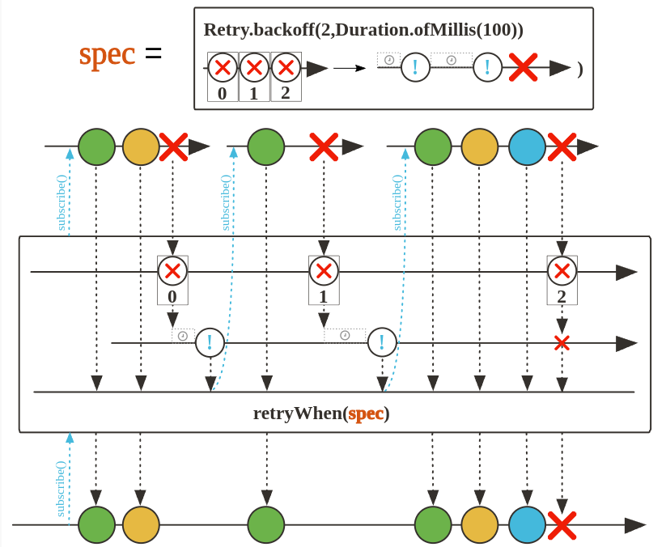

# Tratamento de erros

## onErrorReturn

Basta emitir um valor de fallback capturado quando um erro do tipo especificado for observado neste Flux.

Quando um erro é capturado, o fluxo é finalizado e o valor de fallback é emitido.


``` java

 @Test
    public void onErrorReturnMonetization() {
        YoutubeChannel youtubeChannel = new YoutubeChannel(MockVideo.generateVideos());

        MonetizationCalculator monetizationCalculator = new MonetizationCalculator();

        youtubeChannel.getAllVideos()
                .flatMap(video -> monetizationCalculator.calculate(video))
                .onErrorReturn(0.0)
                .subscribe(value -> System.out.println("$ " + value));
    }
```

## OnErrorResume

Assine um publicador de fallback retornado quando ocorrer algum erro, usando uma função para escolher o fallback dependendo do erro.


``` java
@Test
    public void onErrorResumeMonetization(){
        YoutubeChannel youtubeChannel = new YoutubeChannel(MockVideo.generateVideos());

        MonetizationCalculator monetizationCalculator = new MonetizationCalculator();

        youtubeChannel.getAllVideos()
                .flatMap(video -> monetizationCalculator.calculate(video))
                .onErrorResume(exception ->{
                    System.out.println("onErrorResume");
                    return Flux.just(0.0, 999.00);
                })
                .subscribe(value -> System.out.println(value));
    }
```

## onErrorContinue

Permita que operadores compatíveis a montante se recuperem de erros, removendo o elemento incriminador da sequência e continuando com os elementos subsequentes. O erro recuperado e o valor associado são notificados por meio do BiConsumer. Alternativamente, o lançamento a partir desse biconsumidor propagará a exceção lançada a jusante, no lugar do erro original, que é adicionado como uma exceção suprimida à nova exceção.


``` java

    @Test
    public void onErrorContinueMonetization(){
        YoutubeChannel youtubeChannel = new YoutubeChannel(MockVideo.generateVideos());

        MonetizationCalculator monetizationCalculator = new MonetizationCalculator();

        youtubeChannel.getAllVideos()
                .flatMap(video ->  monetizationCalculator.calculate(video))
                .onErrorContinue((throwable, object) -> {
                    Video video = (Video) object;
                    System.out.println("onErrorContinue "+ video.getName());
                })
                .subscribe(value -> System.out.println(value));
    }
```

## onErrorMap

Transforme o erro observado em um novo erro, que será propagado.

Transforme qualquer erro emitido por isso Flux aplicando uma função a ele de forma síncrona.


``` java
    @Test
    public void onErrorMapMonetization(){
        YoutubeChannel youtubeChannel = new YoutubeChannel(MockVideo.generateVideos());

        MonetizationCalculator monetizationCalculator = new MonetizationCalculator();

        youtubeChannel.getAllVideos()
                .flatMap(video -> monetizationCalculator.calculate(video))
     .onErrorMap(exception -> {
     System.out.println("onErrorMap");
     return new RuntimeException("Erro ao calcular monetização", exception);
     })
                .subscribe(value -> System.out.println(value));
    }

```

## onErroComplete

Basta completar a sequência substituindo um onError signal por um onComplete signal. Todos os outros sinais são propagados como estão.


``` java

    @Test
    public void onErrorCompleteMonetization(){
        YoutubeChannel youtubeChannel = new YoutubeChannel(MockVideo.generateVideos());

        MonetizationCalculator monetizationCalculator = new MonetizationCalculator();

        youtubeChannel.getAllVideos()
                .flatMap(video -> monetizationCalculator.calculate(video))
                .onErrorComplete()
                .doFinally(signalType -> System.out.println("Sinal "+ signalType))
                .subscribe(value -> System.out.println(value));
    }

```

## IsEmpty e defaultIfEmpty e switchIfEmpty

**defaultIfEmpty** Forneça um valor exclusivo padrão se esta sequência for concluída sem nenhum dado(retorna somente se todos os elementos forem Empty).


**switchIfEmpty** Mude para uma alternativa Publisher se esta sequência for concluída sem nenhum dado. (Adicionar um publisher alternativo caso o fluxo esteja vazio).


``` java
@Test
    public void isEmptyMonetization(){
        YoutubeChannel youtubeChannel = new YoutubeChannel(MockVideo.generateVideos3());

        MonetizationCalculator monetizationCalculator = new MonetizationCalculator();

        youtubeChannel.getAllVideos()
                .flatMap(video ->  monetizationCalculator.calculate(video))
                .switchIfEmpty(Flux.just(0.0, 1.0))
                .subscribe(value -> System.out.println(value));
    }
```

## Retry e retryWhen

**retry** Reassina esta Fluxsequência se ela sinalizar algum erro, por um número fixo de vezes. Observe que a passagem de Long.MAX_VALUE é tratada como uma tentativa infinita.


**retryWhen** Tenta novamente Fluxem resposta aos sinais emitidos por um companheiro . PublisherO companheiro é gerado pela Retry instância fornecida, consulte Retry.max(long)e para construtores de estratégias prontamente disponíveis. Retry.maxInARow(long)Retry.backoff(long, Duration)



``` java
 @Test
    public void retryMonetization() throws InterruptedException {
        YoutubeChannel youtubeChannel = new YoutubeChannel(MockVideo.generateVideos());

        VideoAnalyser videoAnalyser = new VideoAnalyser();

        youtubeChannel.getAllVideos()
                .log()
                .map(video -> videoAnalyser.analyse(video))
                .retryWhen(Retry.fixedDelay(2, Duration.ofSeconds(2)))
                .subscribe();

        Thread.sleep(10000);
    }
```

## Resumo

- **onErrorReturn:** Define um valor padrão para ser retornado em caso de erro;

- **onErrorResume:** Permite definir um Publisher de fallback em caso de erro;

- **onErrorContinue:** Permite continuar a execução mesmo após ocorrer um erro;

- **onErrorMap:** Transforma um tipo de erro em outro;

- **onErrorComplete:** Descarta o erro e simplesmente completa o Flux ou Mono.

- **defaultIfEmpty:** Define um valor padrão para ser emitido caso o Flux ou Mono esteja vazio;

- **switchIfEmpty:** Troca o Flux ou Mono por outro Flux ou Mono alternativo caso esteja vazio.

- **retry:** Tenta novamente a operação em caso de erro;

- **retryWhen:** Tenta novamente a operação em caso de erro, de forma customizável.
